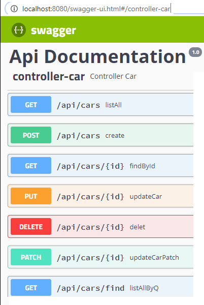

# Fabrica de carros
> projeto para simular a fabricação de carros.


[![Build Status][travis-image]][travis-url]

De um a dois parágrafos sobre o que é seu projeto e o que ele faz.


## Instalação

OS X & Linux:

```sh
mvn clean instal e java -jar carstore.jar
```

Windows:

```sh
mvn clean instal e java -jar carstore.jar
```
>So executar o projeto e sua classe principal "Application" com [javaApplication ou run springBoot] <br>
>ou executar os testes Unitarios

## Documentação Swagger
> Pode ser encontrada em -> 
http://localhost:8080/swagger-ui.html#/controller-car



## Exemplos de Uso
API Endpoints<br>

GET /cars<br>
Retorna todos os veiculos<br>

-------------------------------

GET /cars/find?q=turbo<br>
Retorna todos os veiculos com esse parametro<br>

-------------------------------

GET /cars/{id}<br>
Retorna o veiculos pelo id<br>

-------------------------------

POST /cars/{id}<br>
salva veiculos<br>

body request<br>
{<br>
    "name": " turbo",<br>
    "description": "2 portas 1.0",<br>
    "model": {<br>
        "producer": {<br>
            "name": "RENAULT"<br>
        },<br>
        "brand": "NOVO CLIO 2021"<br>
    },<br>
    "created": "2021-01-08T01:24:19.251+0000",<br>
    "updated": "2021-01-08T01:24:19.251+0000",<br>
    "status": "AVAILABLE",<br>
    "year": 1980<br>
}<br>
-------------------------------
PATCH /cars/{id}<br>
Atualiza veiculos<br>

body request<br>
{<br>
    "name": " turbo",<br>
    "description": "4 portas 1.0"<br>
}<br>
-------------------------------

PUT /cars<br>
atualiza veiculos<br>

body request<br>
```
{<br>
    "name": " turbo",<br>
    "description": "2 portas 1.0",<br>
    "model": {<br>
        "producer": {<br>
            "name": "RENAULT"<br>
        },<br>
        "brand": "NOVO CLIO 2021"<br>
    },<br>
    "created": "2021-01-08T01:24:19.251+0000",<br>
    "updated": "2021-01-08T01:24:19.251+0000",<br>
    "status": "AVAILABLE",<br>
    "year": 1980<br>
}<br>
```
-------------------------------
DELET /cars/{id}<br>
remove carro<br>
-------------------------------

## Configuração para Desenvolvimento

```sh
mvn install
mvn test all
```

## Histórico de lançamentos
* 0.0.3
     * Atualizar readme
* 0.0.2
     * Incluir swagger

* 0.0.1
     * Trabalho em desenvolvimento

## Meta

Edivaldo soares – [@Edivaldo](https://twitter.com/edivaldo100) – edivaldo100@gmail.com

[https://github.com/edivaldo100/]


